# 🌾 E-Farming - Full Stack Web Application

E-Farming is a modern platform that connects **farmers** and **buyers**. Farmers can upload their fresh produce, and buyers can place orders, manage a cart, and complete payments securely. Admins oversee platform activity.

## 📁 Project Structure

---

## 🚀 Features

- Farmer and Buyer Registration & Login
- Product Uploading and Shopping Cart
- Razorpay Payment Gateway
- Order Tracking
- Admin Dashboard and Analytics
- MongoDB for backend storage

---

## 🖼️ Screenshots

### 🏠 Home Page
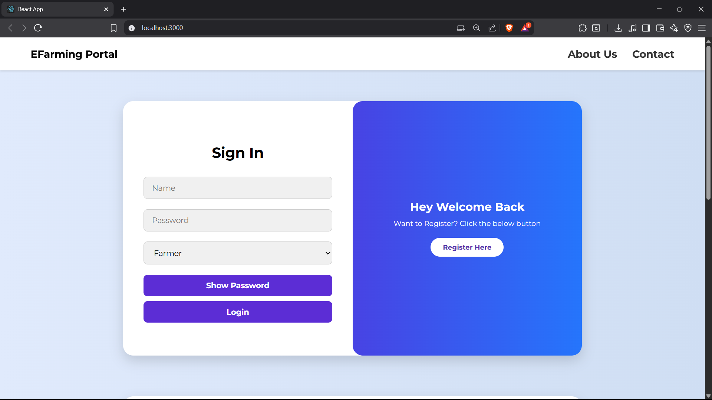  
Landing page of E-Farming with a clean navbar, branding, and navigation to login/register.

---

### ℹ️ About Page
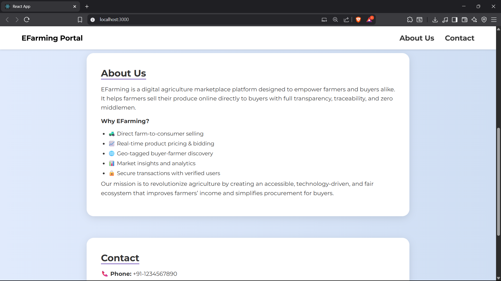  
Explains the purpose of the E-Farming platform and how it empowers farmers and connects them to buyers.

---

### 📝 Register Page
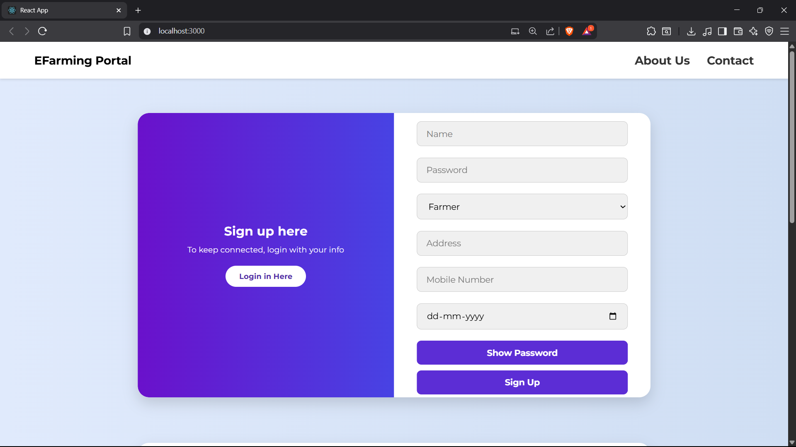  
A clean interface for users to register as either **farmer** or **buyer** using secure credentials.

---

### 👨‍🌾 Farmer Dashboard
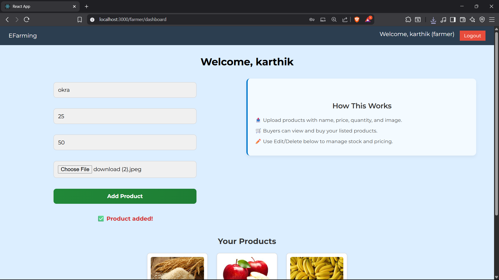  
Farmers see an overview of their uploaded products and can manage their inventory from here.

---

### ➕ Add Product
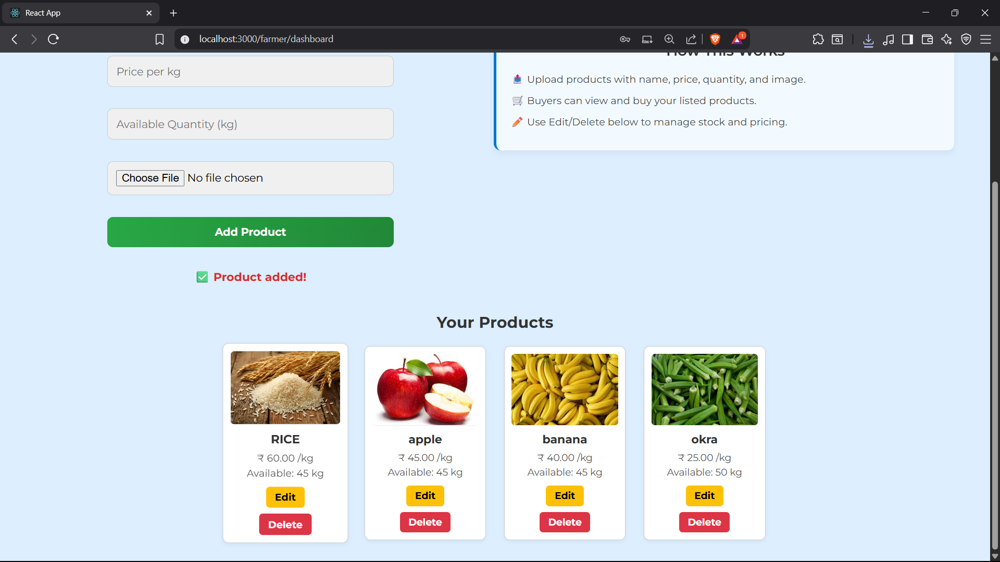  
Form for farmers to upload new products, including name, quantity, price, and image.

---

### 🧑‍💼 Buyer Dashboard
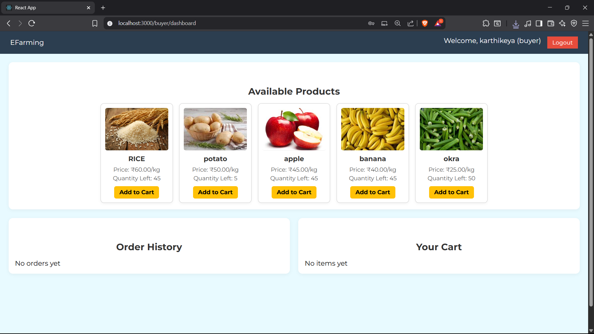  
Buyers can view all available products, manage their cart, and place orders directly.

---

### 📍 Address Form
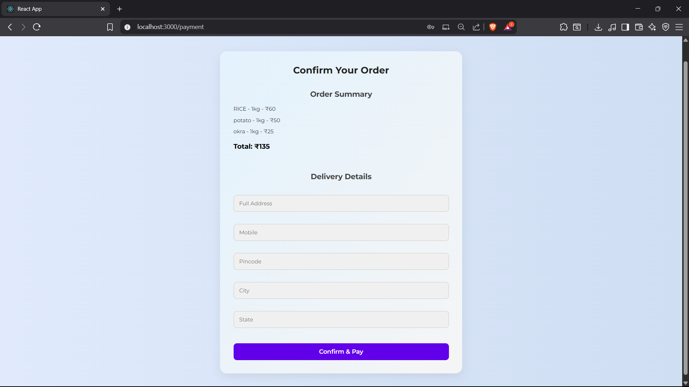  
Before proceeding to payment, buyers must enter a delivery address.

---

### 💳 Payment Page
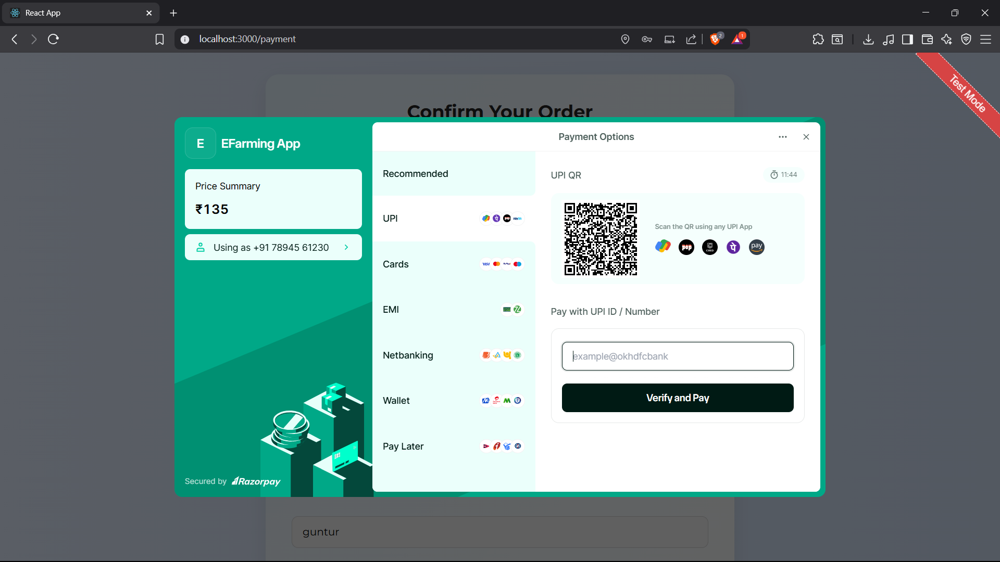  
Secure Razorpay integration for processing online payments after cart checkout.

---

### ✅ Order Success
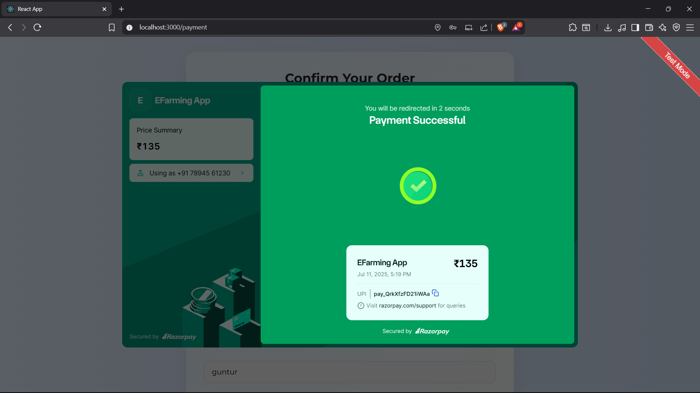  
Confirmation page shown to buyers after a successful transaction and order placement.

---

### 📦 Order Details
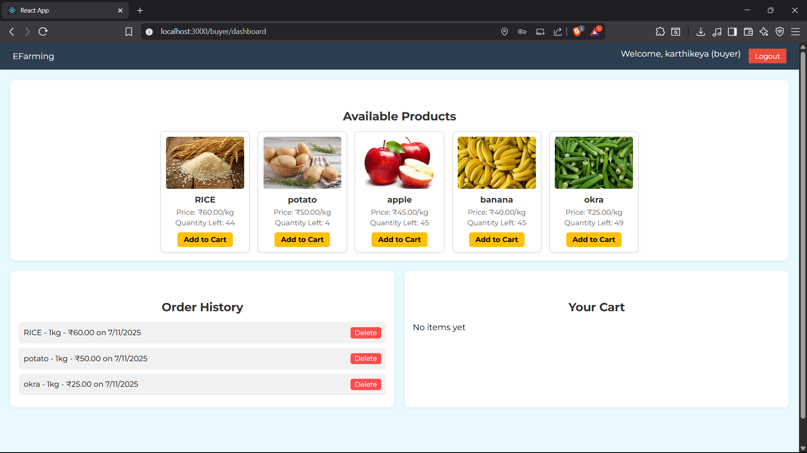  
Buyers can view a history of their orders, with product details and payment info.

---

### 🛡️ Admin Dashboard
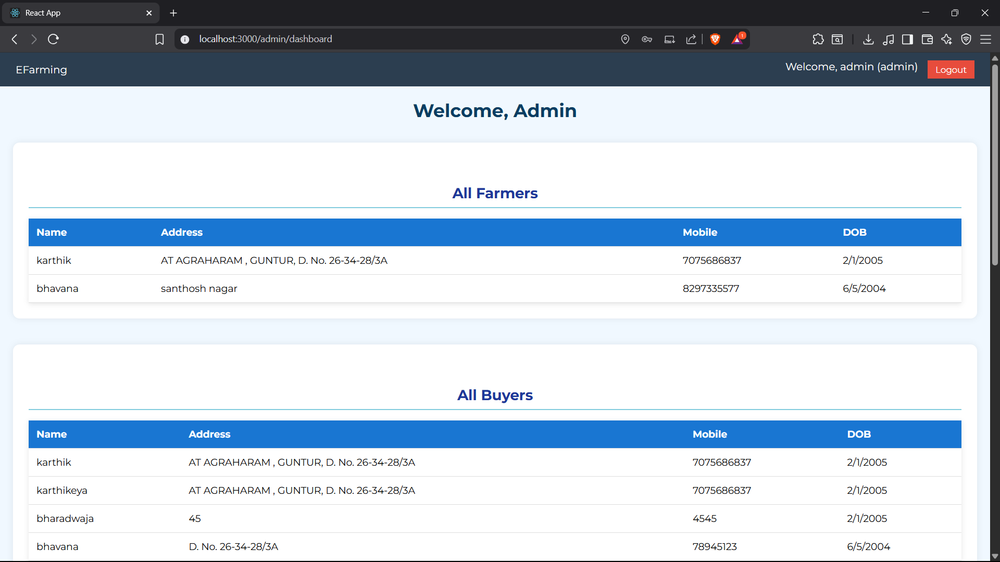  
Admins can see total farmers, buyers, orders in a clean overview format.

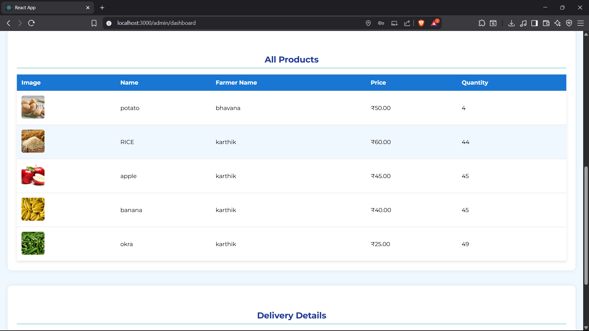  

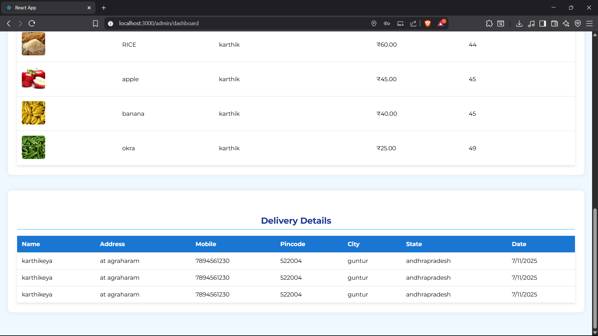  

## ⚙️ Tech Stack

- **Frontend**: React.js, HTML, CSS
- **Backend**: Node.js
- **Database**: MySQL
- **Payments**: Razorpay API

---

